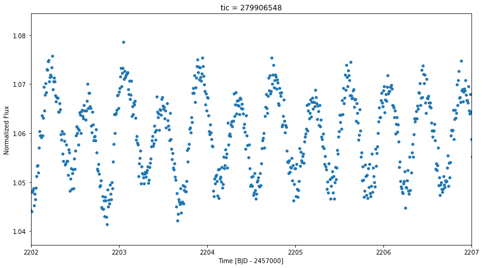

We present a new eclipsing binary found in Tarleton Observatory’s archival data. The observations
were conducted from December 10, 2020 to December 22, 2020, spanning over 9 nights. We found
the period of the binary to be 0.595 days using Lomb-Scargle periodogram. The target is also
observed in TESS and Asteroid Terrestrial Impact Last Alert System (ATLAS) missions. The
primary is a A9 sub-giant. The system is located in the IAU constellation of Monoceros. We present
a new set of orbital parameters of the candidate using transit data from Tarleton Observatory, crossmatched
with TESS light curves for the target. The light curve modeling was done using Wilson-
Devinney code.

    <figure style="text-align: center;">
        
        <figcaption>Phase-folded lightcurve from Tarleton Observations</figcaption>
    </figure>
    

